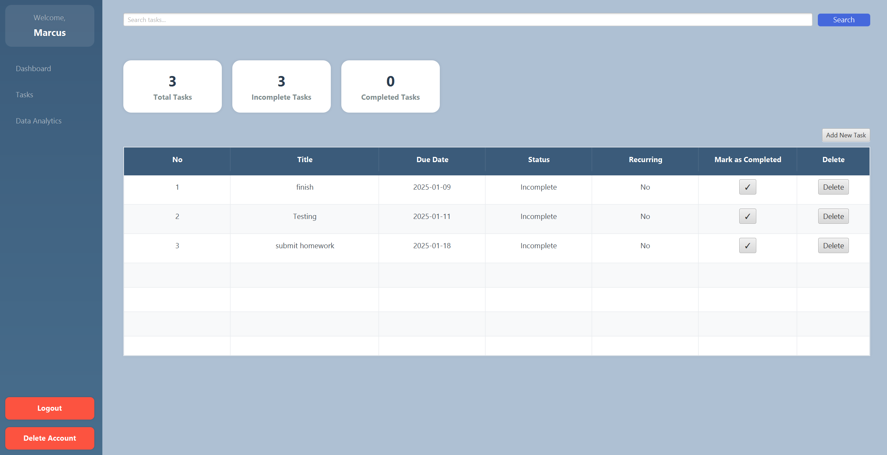
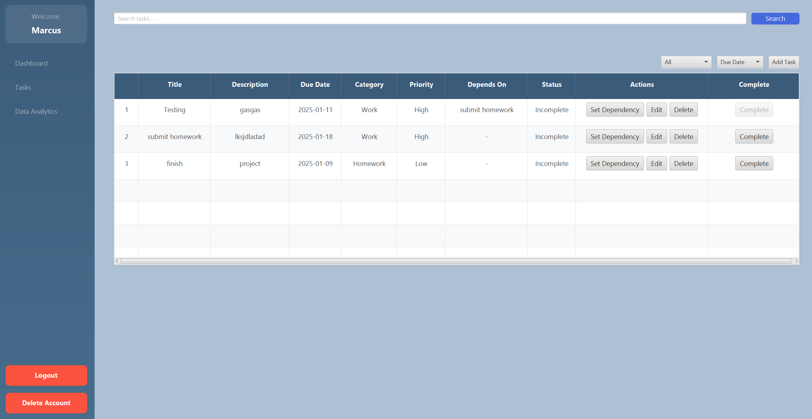
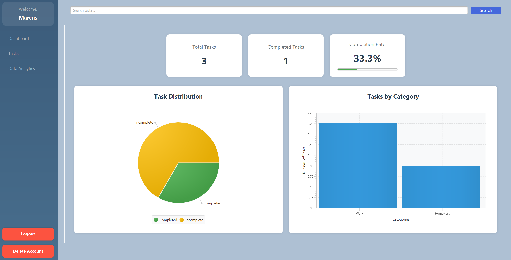

# 📝 To-Do List App

<div align="center">
  
  
  A simple and intuitive Java-based ToDo application to help you manage your tasks efficiently.
</div>

---

## Features

- **📋 Task Management**
  - Create, edit, and delete tasks
  - Set task priorities and categories
  - Sort tasks by due date, categories and priority
  - Task dependencies support
  - Recurring tasks functionality

- **🔒 User System**
  - Secure authentication
  - User-specific task management
  - Password hashing for user accounts
  - Log out and delete account

- **📊 Analytics & Insights**
  - Task completion statistics
  - Category-wise distribution
  - Progress tracking

- **🔔 Smart Notifications**
  - Email notifications for tasks due within 24 hours
  - Welcome email for new account registration

---

## Application Showcase

<div align="center">
  <table>
    <tr>
      <td align="center"><b>Login</b></td>
      <td align="center"><b>Registration</b></td>
    </tr>
    <tr>
      <td></td>
      <td></td>
    </tr>
    <tr>
      <td align="center"><b>Dashboard</b></td>
      <td align="center"><b>Task Management</b></td>
    </tr>
    <tr>
      <td></td>
      <td></td>
    </tr>
    <tr>
      <td colspan="2" align="center"><b>Data Analytics</b></td>
    </tr>
    <tr>
      <td colspan="2" align="center"></td>
    </tr>
  </table>
</div>

---

## Technical Requirements

- Java 17 or later
- JavaFX (included in distribution)
- SQLite Database
- Email service configuration

---

## Installation

### Prerequisites
- **Java Runtime Environment (JRE)**: Ensure you have Java 17 or later installed. Download it from [Adoptium](https://adoptium.net/).
- **JavaFX Runtime** (if not bundled): Download the JavaFX SDK from [Gluon](https://gluonhq.com/products/javafx/).

### Download the Application
1. Go to the [Releases page](https://github.com/your-username/your-repo/releases).
2. Download the latest `.exe` file (e.g., `ToDoApp.exe`).

---

## Usage

### Running the Application
1. Double-click the downloaded `.exe` file to launch the application.
2. Log in with your credentials or register a new account.
3. Add, edit, or delete tasks as needed.

### Command Line (Optional)
```bash
java --module-path /path/to/javafx-sdk/lib --add-modules javafx.controls,javafx.fxml -jar ToDoApp.jar
```

---

## License

This project is licensed under the [MIT License](LICENSE).